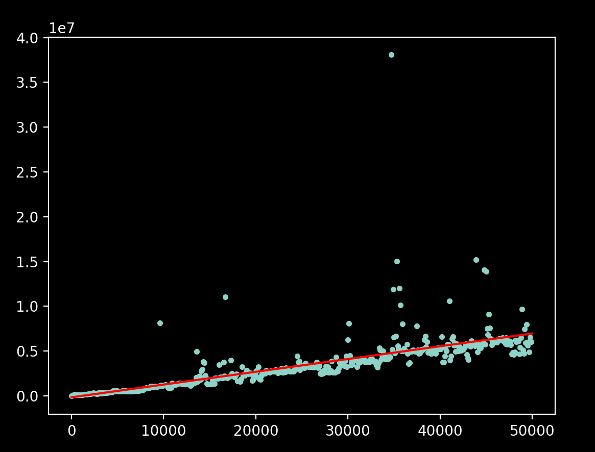
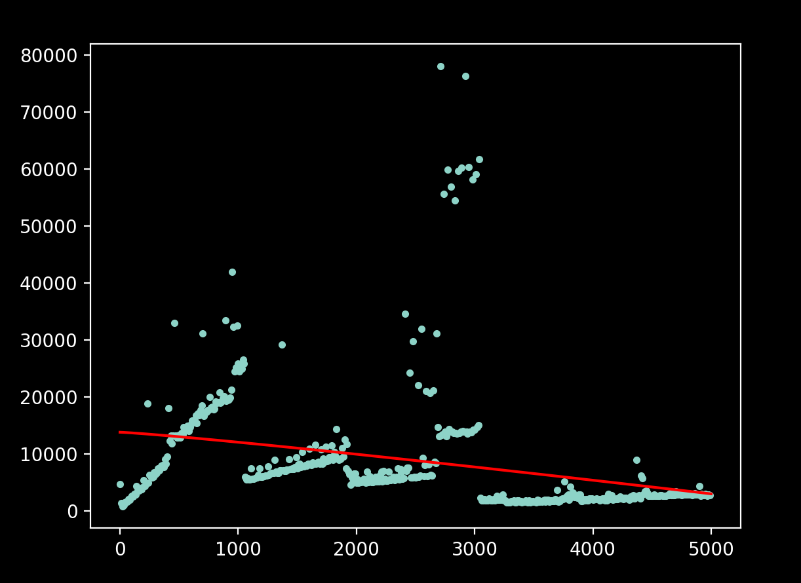
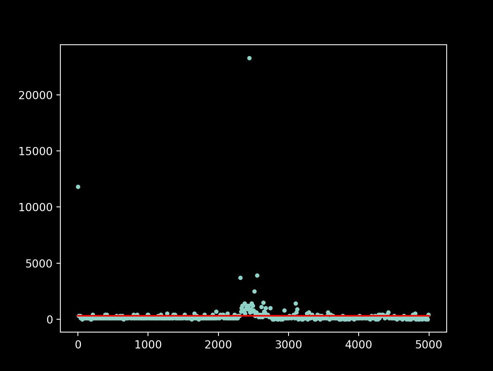

# Examples of jFit usage

## Analysing $O(n\log n)$ curves:
- Replace the body `public static void method()` with the body of the method you are analysing. Here, we shall use quick sort:
    ```java
    public static void method(long[] array, int n) {
        quickSort(array, 0, n - 1);
    }

    private static void quickSort(long[] array, int low, int high) {
        if (low < high) {
            int pivotIndex = partition(array, low, high);
            quickSort(array, low, pivotIndex - 1);
            quickSort(array, pivotIndex + 1, high);
        }
    }

    private static int partition(long[] array, int low, int high) {
        long pivot = array[high];
        int i = low - 1;

        for (int j = low; j < high; j++) {
            if (array[j] < pivot) {
                i++;
                swap(array, i, j);
            }
        }

        swap(array, i + 1, high);
        return i + 1;
    }

    private static void swap(long[] array, int i, int j) {
        long temp = array[i];
        array[i] = array[j];
        array[j] = temp;
    }
    ```
- In the main function body, change the last arguement of `ComplexityAnalyzer.generatePy` to `EFFICIENCY_CLASS.LINEARTHMIC` for $O(n\log n)$ functions. Update the start and end ranges accordingly, as well as the step value.
    ```java
    ComplexityAnalyzer.generatePy(0, 50000, 100, EFFICIENCY_CLASS.LINEARITHMIC);
    ```
- Run the script. You should see the following graph:<br>
     <br>
- If you get `Execution failed. Manually run 'file.py'`, naviagate to `file.py` and run it manually.

Similarly, here's the jFit i/p & o/p for all other efficiency classes

- ### $O(n)$ algorithms
    ```java
    public static void method(long[] array, int n) {
        int sum=0;
        for(int i=0; i<n; i++){
            sum+=array[i];
        }
    }
    ```
     <br>
    *Note:* Attempting to analyse linear time curves over large ranges of n results in a plot with several segmented lines, most likely due to caching effects. jFit currently can't fit a good curve to such data, but support for segmented regression is planned.

- ### $O(1)$ algorithms
    ```java
    public static void method(long[] array, int n) {
        double ln7 = Math.log(7);
        double logn = Math.log(array[n-1])/ln7;
    }
    ```
     <br>
    *Note:* Attempting to analyse linear time curves over large ranges of n results in a plot with several segmented lines, most likely due to caching effects. jFit currently can't fit a good curve to such data, but support for segmented regression is planned.

